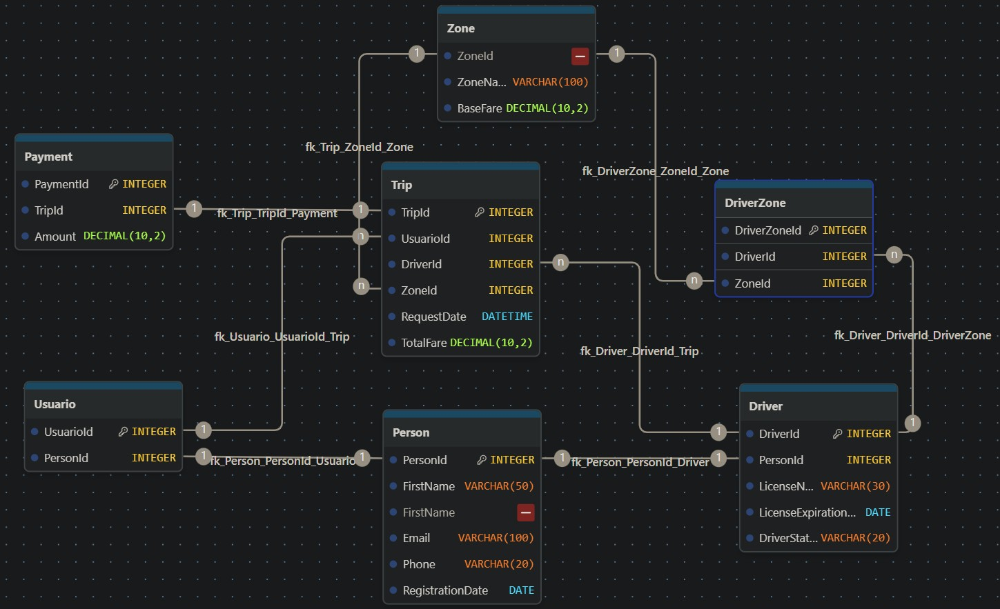

# Ride-Hailing Data Platform (SQL & Data Modeling Project)

## 📌 Overview

This project simulates a ride-hailing platform (similar to Uber), focusing on relational database design, data integrity, and data validation processes.

The database was designed using SQL Server, applying normalization principles up to Third Normal Form (3NF) to ensure consistency and eliminate redundancy.

---

## 🧠 Key Features

- Relational database design (3NF)
- Data integrity through primary and foreign keys
- Validation rules and structured relationships
- Simulation of real-world scenarios (users, drivers, trips, payments)

---

## 🗂️ Data Models

### Entity-Relationship Model

### Relational Model

---

## ⚙️ Technologies Used

- SQL Server
- SQL Server Management Studio (SSMS)
- Docker
- Visual Studio Code

---

## 📊 SQL Implementation

The project includes:

- Table creation (DDL)
- Data relationships and constraints
- Queries (joins, filtering, aggregations)
- Views for reporting and validation

👉 See SQL script: `sql/uber_transport_platform.sql`

---

## 🚀 Key Learnings

- Designing normalized databases (3NF)
- Ensuring data quality and consistency
- Writing SQL queries for data validation and reporting
